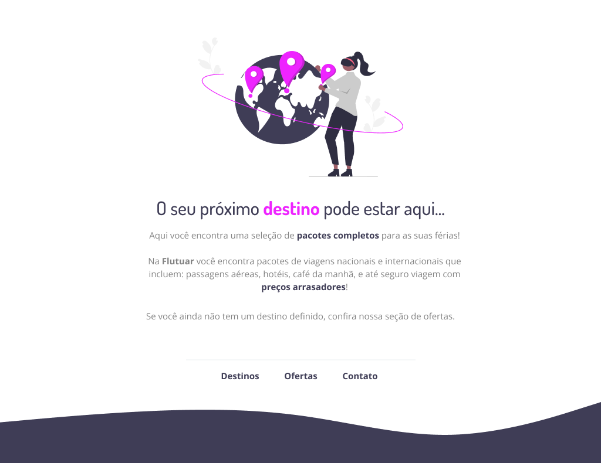

# Desafio intermediário - Rocketseat

# 💻 Sobre o desafio

Nesse desafio, você deverá recriar uma aplicação, a partir de um layout pronto no Figma, para fortalecer alguns conceitos aprendidos na aula, entre eles:

- Estruturando um projeto HTML;
- Uso de tags HTML mais comuns;
- Conceitos iniciais de CSS;
- Posicionamento e alinhamento de elementos na tela;
- Aplicando fontes customizadas;
- Espaçamentos.
